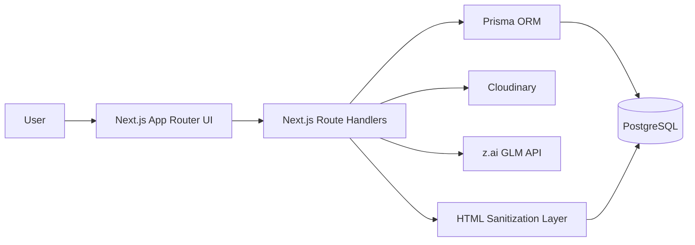
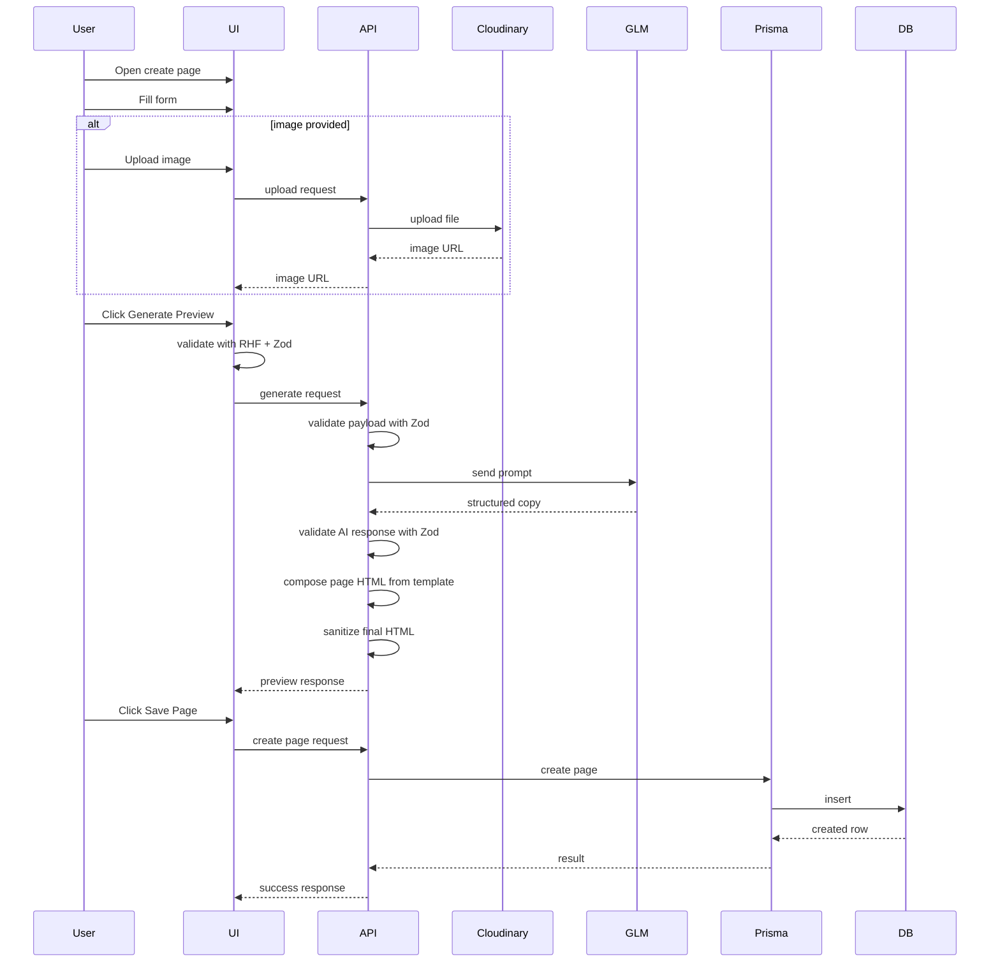
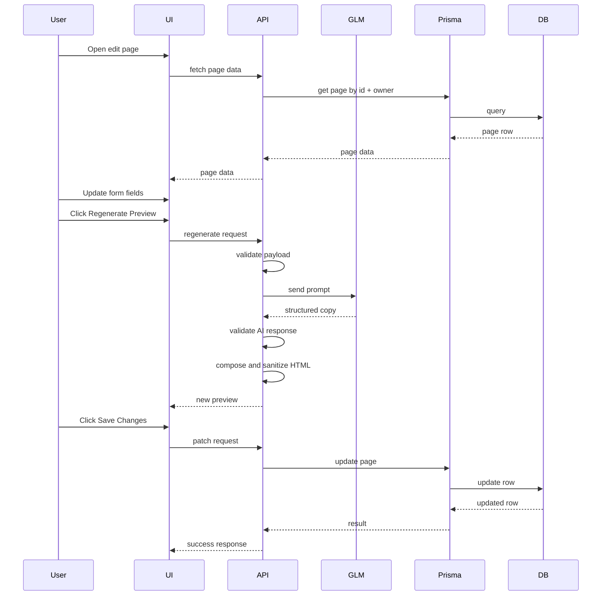
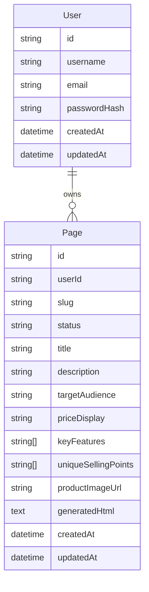

# CLAUDE.md — Pagenify Full Application Requirements

## 1. Purpose of This File

This document is the **single source of truth** for implementing the full MVP version of **Pagenify**.

This file is written for **Claude Code / AI coding agents**, not for human stakeholders.
The agent must follow this document when making implementation decisions.

If a future coding decision conflicts with this file, **this file wins** unless the user explicitly changes the requirement.

The goal of this file is to remove ambiguity during development and provide a complete, implementation-ready requirement set for one application.

---

## 2. Product Definition

### 2.1 Product Name
**Pagenify**

### 2.2 Product Summary
Pagenify is an AI-powered web application that allows authenticated users to generate structured sales pages for:
- physical products
- digital products
- services
- general commercial offers

The user provides structured offer information through a guided form, optionally uploads a product image, generates a preview using an LLM, and saves the final page. Saved pages are managed inside the dashboard and exposed through public shareable URLs.

### 2.3 Product Goal
The product goal is to let a user create a persuasive, clean, and presentable sales page quickly without manually writing copy or coding HTML.

The MVP must optimize for:
- implementation speed
- stable behavior
- clean architecture
- strong validation
- safe AI integration
- minimal ambiguity
- good UX feedback

### 2.4 Core Product Principles
1. Structured input is preferred over open-ended input.
2. Server-side logic is preferred for trusted operations.
3. AI generates structured copy, not uncontrolled raw page markup.
4. HTML composition must be controlled by the app.
5. The app must be clean and simple, not overengineered.
6. Everything important must be validated.
7. Every important user action must provide visible feedback.

---

## 3. Final Product Decisions

These decisions are final and must be respected by the implementation.

1. **Create Page uses a dedicated page route.**
2. **Edit Page uses a dedicated page route.**
3. **Large interactions use page-based UX, not modal-based UX.**
4. **Delete is implemented as soft delete only.**
5. **Soft-deleted pages are recoverable.**
6. **The LLM provider is z.ai.**
7. **The LLM family is GLM.**
8. **The exact GLM model is provided through environment variables.**
9. **Prisma ORM is mandatory for all database access.**
10. **PostgreSQL is the primary database.**
11. **Zod is mandatory on both client and server.**
12. **React Hook Form is mandatory for forms.**
13. **Toast feedback is mandatory for important actions.**
14. **The app must use a fixed internal sales page template.**
15. **The LLM returns structured content only.**
16. **Generated HTML must be sanitized.**
17. **All protected actions must verify ownership.**
18. **Slug is generated once on create and does not auto-change on edit.**
19. **Public page URLs use username + slug.**
20. **Optional product image is part of MVP.**
21. **Archived pages are not publicly viewable.**
22. **Archived pages can be recovered back to ACTIVE state.**
23. **Do not add features outside MVP scope unless explicitly asked.**
24. **Prefer clarity over abstraction-heavy architecture.**

---

## 4. MVP Scope

### 4.1 Included in MVP
- user registration
- user login
- user logout
- JWT-based auth via HttpOnly cookies
- protected dashboard
- active pages list
- archived pages list
- create page route
- edit page route
- soft delete / archive page
- recover archived page
- optional product image upload
- AI-generated sales copy using z.ai GLM
- live preview on create page
- live preview on edit page
- save new page
- update existing page
- public sales page route
- shared API response format
- Prisma ORM
- Zod validation
- React Hook Form
- toast notifications
- structured error handling
- fixed internal sales page template
- HTML sanitization

### 4.2 Explicitly Out of Scope
- multiple page templates
- drag-and-drop builder
- export as HTML
- analytics dashboard
- payment integration
- admin panel
- collaboration / team accounts
- role system
- WYSIWYG editor
- version history
- AI chat assistant
- section-by-section regeneration
- advanced SEO settings UI
- A/B testing
- custom domain support
- theme customizer

---

## 5. Target User

The MVP is built for a general authenticated user who wants to create a sales page quickly.

Typical user intent:
- describe a product or service
- optionally upload a product image
- generate persuasive copy
- preview the result
- save the page
- share it publicly

The UI should feel simple, direct, and outcome-oriented.

---

## 6. Core User Flows

### 6.1 Primary Create Flow
1. User opens the app.
2. If unauthenticated, user is redirected to login.
3. User registers or logs in.
4. User lands on dashboard.
5. User clicks **Create Page**.
6. User navigates to `/dashboard/pages/new`.
7. User fills the form.
8. User optionally uploads an image.
9. User clicks **Generate Preview**.
10. Client validates input with Zod.
11. Server validates input again with Zod.
12. Server sends the prompt to z.ai GLM.
13. GLM returns structured sales copy.
14. Server validates GLM response with Zod.
15. Server composes final HTML using internal template.
16. Server sanitizes final HTML.
17. Preview is displayed on the create page.
18. User clicks **Save Page**.
19. Server creates a page row with `status = ACTIVE`.
20. User is redirected to the edit page or dashboard depending on chosen save UX.
21. Saved page is accessible through `/u/[username]/[slug]`.

### 6.2 Edit Flow
1. User opens dashboard.
2. User clicks **Edit** on an ACTIVE page.
3. User navigates to `/dashboard/pages/[id]/edit`.
4. Existing values are loaded into the form.
5. Stored HTML or regenerated preview is shown.
6. User updates fields.
7. User optionally uploads a new image, keeps existing image, or removes image.
8. User clicks **Regenerate Preview**.
9. Server regenerates preview.
10. User reviews preview.
11. User clicks **Save Changes**.
12. Existing page row is updated.

### 6.3 Archive Flow
1. User clicks **Archive** on an ACTIVE page.
2. Confirmation dialog appears.
3. User confirms.
4. Server verifies ownership.
5. Server changes page `status` from `ACTIVE` to `ARCHIVED`.
6. Page disappears from active list.
7. Success toast is shown.

### 6.4 Recover Flow
1. User opens `/dashboard/archived`.
2. User clicks **Recover** on an ARCHIVED page.
3. Server verifies ownership.
4. Server changes page `status` from `ARCHIVED` to `ACTIVE`.
5. Page returns to active list.
6. Success toast is shown.

### 6.5 Public View Flow
1. Visitor opens `/u/[username]/[slug]`.
2. Server fetches page by username + slug.
3. If page is ACTIVE, sanitized HTML is rendered.
4. If page is ARCHIVED or not found, return 404.

---

## 7. Information Architecture

### 7.1 Route Map

Public routes:
- `/`
- `/login`
- `/register`
- `/u/[username]/[slug]`

Protected routes:
- `/dashboard`
- `/dashboard/pages/new`
- `/dashboard/pages/[id]/edit`
- `/dashboard/archived`

### 7.2 Route Intent

#### `/`
- entry route only
- if authenticated, redirect to `/dashboard`
- if not authenticated, redirect to `/login`

#### `/login`
- login screen

#### `/register`
- registration screen

#### `/dashboard`
- active pages list
- create page CTA
- navigation to archived pages
- logout action

#### `/dashboard/pages/new`
- dedicated create page screen
- form + preview

#### `/dashboard/pages/[id]/edit`
- dedicated edit page screen
- prefilled form + preview

#### `/dashboard/archived`
- archived pages list
- recover actions

#### `/u/[username]/[slug]`
- public generated sales page

---

## 8. Diagrams

### 8.1 Navigation Diagram

```mermaid
flowchart TD
    A[/] --> B{Authenticated?}
    B -- No --> C[/login]
    B -- Yes --> D[/dashboard]

    C --> E[/register]
    E --> C
    C --> D

    D --> F[/dashboard/pages/new]
    D --> G[/dashboard/pages/[id]/edit]
    D --> H[/dashboard/archived]
    D --> I[/u/[username]/[slug]]

    H --> D
    G --> D
    F --> D
```

### 8.2 High-Level Architecture Diagram



### 8.3 Sequence Diagram — Create Page



### 8.4 Sequence Diagram — Edit Page



### 8.5 Entity Diagram



---

## 9. Page-by-Page Requirements

### 9.1 `/login`

**Purpose**
- authenticate existing users

**Contents**
- email field
- password field
- login button
- register link

**Behavior**
- validate with Zod
- submit to login API
- on success, set cookie and redirect to dashboard
- on error, show toast and inline errors where appropriate

### 9.2 `/register`

**Purpose**
- create a user account

**Contents**
- username field
- email field
- password field
- confirm password field
- register button
- login link

**Behavior**
- validate with Zod
- submit to register API
- on success, auto-login is recommended
- redirect to dashboard after success

### 9.3 `/dashboard`

**Purpose**
- active page management hub

**Contents**
- dashboard header
- create page CTA
- active pages list
- archived pages navigation
- logout control

**Each page item must show**
- title
- public URL
- created date
- updated date
- view action
- edit action
- archive action

**States**
- loading
- empty
- loaded
- error

### 9.4 `/dashboard/pages/new`

**Purpose**
- create a new sales page

**Layout**
- desktop: two-column layout
  - left: form
  - right: preview
- mobile: stacked layout
  - form first
  - preview second

**Contents**
- breadcrumb or back link
- page title
- form section
- preview section
- generate preview button
- save page button

**Form fields**
- title
- description
- targetAudience
- priceDisplay
- keyFeatures multi-input
- uniqueSellingPoints multi-input
- optional image upload

**Behavior**
- generate preview validates form
- save disabled until preview exists
- preview updates after generation
- success and error handled with toast

### 9.5 `/dashboard/pages/[id]/edit`

**Purpose**
- edit and regenerate an existing page

**Contents**
- breadcrumb or back link
- page title
- prefilled form
- preview section
- regenerate preview button
- save changes button

**Behavior**
- page loads by ID with owner verification
- only ACTIVE pages are editable in MVP
- if page is ARCHIVED, block edit and redirect to archived route or show recover-first message

### 9.6 `/dashboard/archived`

**Purpose**
- manage archived pages

**Contents**
- archived pages list
- recover action
- link back to dashboard

**Behavior**
- show only ARCHIVED pages belonging to current user
- recover switches status to ACTIVE

### 9.7 `/u/[username]/[slug]`

**Purpose**
- public sales page route

**Behavior**
- fetch page by username + slug
- only render ACTIVE pages
- if ARCHIVED or not found, return 404
- render sanitized stored HTML only

---

## 10. Final Tech Stack

### 10.1 Required Stack
- **Framework:** Next.js App Router
- **Language:** TypeScript
- **Database:** PostgreSQL
- **ORM:** Prisma ORM
- **Validation:** Zod
- **Forms:** React Hook Form + `@hookform/resolvers/zod`
- **UI Components:** shadcn/ui
- **Styling:** Tailwind CSS
- **State Management:** Zustand
- **Toast:** Sonner
- **Authentication:** JWT via HttpOnly cookies
- **Password Hashing:** bcryptjs
- **JWT Utility:** jose
- **LLM Provider:** z.ai
- **LLM Family:** GLM
- **LLM Model:** environment-driven via `ZAI_GLM_MODEL`
- **Image Upload:** Cloudinary
- **Slug Utility:** slugify
- **HTML Sanitization:** sanitize-html
- **Icons:** lucide-react
- **Utilities:** clsx, tailwind-merge

### 10.2 Development Tooling
- ESLint
- Prettier
- TypeScript strict mode
- Prisma Migrate
- Vitest
- Playwright

---

## 11. Environment Variables

The implementation must support at least these environment variables:

```text
DATABASE_URL=
JWT_SECRET=
ZAI_API_KEY=
ZAI_GLM_MODEL=
CLOUDINARY_CLOUD_NAME=
CLOUDINARY_API_KEY=
CLOUDINARY_API_SECRET=
NEXT_PUBLIC_APP_URL=
NODE_ENV=
```

### 11.1 Env Rules
- validate env at startup using Zod
- fail fast if required env variables are missing
- do not hardcode secrets
- do not hardcode the GLM model name into business logic

---

## 12. Prisma Data Model

### 12.1 Data Model Summary
Core entities:
- `User`
- `Page`

### 12.2 Page Status Values
Allowed values:
- `ACTIVE`
- `ARCHIVED`

### 12.3 Draft Prisma Schema

```prisma
generator client {
  provider = "prisma-client-js"
}

datasource db {
  provider = "postgresql"
  url      = env("DATABASE_URL")
}

enum PageStatus {
  ACTIVE
  ARCHIVED
}

model User {
  id           String   @id @default(cuid())
  username     String   @unique
  email        String   @unique
  passwordHash String
  createdAt    DateTime @default(now())
  updatedAt    DateTime @updatedAt

  pages        Page[]
}

model Page {
  id                  String     @id @default(cuid())
  userId              String
  slug                String
  status              PageStatus @default(ACTIVE)
  title               String
  description         String     @db.Text
  targetAudience      String
  priceDisplay        String
  keyFeatures         String[]
  uniqueSellingPoints String[]
  productImageUrl     String?
  generatedHtml       String     @db.Text
  createdAt           DateTime   @default(now())
  updatedAt           DateTime   @updatedAt

  user User @relation(fields: [userId], references: [id], onDelete: Cascade)

  @@index([userId, status])
  @@unique([userId, slug])
}
```

### 12.4 Prisma Rules
- all database access must use Prisma ORM
- no raw SQL unless absolutely necessary
- business logic should be moved into services where appropriate
- route handlers should stay thin when possible

---

## 13. Validation Specification

### 13.1 Register Schema
Fields:
- username: required, min 3, max 30, trimmed
- email: required, valid email
- password: required, min 8
- confirmPassword: required, must match password

### 13.2 Login Schema
Fields:
- email: required, valid email
- password: required

### 13.3 Create/Edit Page Schema
Fields:
- title: required, min 3, max 100
- description: required, min 20
- targetAudience: required
- priceDisplay: required, max 50
- keyFeatures: array of strings, minimum 1 item
- uniqueSellingPoints: array of strings, minimum 1 item
- productImageUrl: optional valid URL or null

### 13.4 Upload Schema
Rules:
- optional file upload
- accepted mime types: `image/jpeg`, `image/png`, `image/webp`
- accepted extensions: jpg, jpeg, png, webp
- max file size: 4MB recommended

### 13.5 AI Response Schema
The AI response must validate against a strict Zod schema.

Required fields:
- `headline`
- `subheadline`
- `descriptionParagraphs`
- `benefits`
- `featuresBreakdown`
- `pricingText`
- `ctaText`
- `socialProofTitle`
- `socialProofBody`
- `faqPlaceholderTitle`
- `faqPlaceholderBody`

---

## 14. Authentication Design

### 14.1 Auth Strategy
Use JWT stored in HttpOnly cookies.

### 14.2 Cookie Rules
- HttpOnly
- SameSite Lax
- Secure in production
- path `/`

### 14.3 JWT Payload
Recommended payload:
- `userId`
- `username`

### 14.4 Protected Areas
Protected:
- dashboard
- create page
- edit page
- archived page
- upload endpoint
- all page CRUD APIs

Public:
- login
- register
- public page route

### 14.5 Required Auth Endpoints
- `POST /api/auth/register`
- `POST /api/auth/login`
- `POST /api/auth/logout`
- `GET /api/auth/me`

---

## 15. URL and Slug Strategy

### 15.1 Public URL Format
Use:
`/u/[username]/[slug]`

### 15.2 Slug Strategy
Generate slug from title + short unique suffix.

Example:
- title: `Super Gadget`
- slug: `super-gadget-3f82`

### 15.3 Slug Stability Rule
Slug is generated only once during create and must not auto-change after edits.

Reason:
- stable public links
- predictable behavior
- lower implementation complexity

---

## 16. LLM Integration Rules

### 16.1 Provider Rule
The application must use **z.ai GLM** as the LLM provider.

### 16.2 Model Rule
The exact model name must be sourced from:
- `ZAI_GLM_MODEL`

### 16.3 Service Rule
All GLM calls must go through a dedicated service file, for example:
- `src/lib/services/llm.service.ts`

Route handlers must not contain large provider-specific logic directly if avoidable.

### 16.4 AI Output Rule
The GLM must return structured content, not uncontrolled raw final HTML.

Correct flow:
1. send structured prompt
2. receive structured response
3. validate with Zod
4. compose HTML using internal template
5. sanitize final HTML
6. return preview or persist final result

---

## 17. Prompting Strategy

### 17.1 Prompting Goal
The prompt must make GLM generate persuasive sales content in a strict structured format that is safe and predictable for server-side template composition.

### 17.2 Prompting Rules
The prompt must:
- treat the input as product, digital product, service, or offer
- keep the language persuasive and clear
- avoid fake claims
- avoid unsupported statements
- avoid markdown
- avoid HTML
- avoid code fences
- return strict JSON only
- fill all required fields
- not fabricate testimonials
- use placeholder-friendly social proof copy
- not mention being an AI model

### 17.3 System Prompt
Use this as the system prompt:

```text
You are an expert direct-response copywriter and landing page strategist.

Your job is to generate structured sales page copy for a product, digital product, service, or commercial offer.

Important rules:
1. Return STRICT JSON only.
2. Do not return markdown.
3. Do not return HTML.
4. Do not wrap the JSON in code fences.
5. Do not include explanations outside the JSON.
6. Write persuasive, clear, concise copy.
7. Do not invent fake claims that are impossible to support.
8. Do not invent real testimonials. Use safe placeholder-style social proof text when needed.
9. Keep the output aligned with this JSON structure exactly.

Required JSON structure:
{
  "headline": "string",
  "subheadline": "string",
  "descriptionParagraphs": ["string", "string"],
  "benefits": ["string", "string", "string"],
  "featuresBreakdown": [
    {
      "title": "string",
      "description": "string"
    }
  ],
  "pricingText": "string",
  "ctaText": "string",
  "socialProofTitle": "string",
  "socialProofBody": "string",
  "faqPlaceholderTitle": "string",
  "faqPlaceholderBody": "string"
}

The content must be suitable for a modern sales page.
```

### 17.4 User Prompt Template for Create and Regenerate
Use this exact shape:

```text
Generate structured sales page copy for the following offer.

Offer type:
{{offerType}}

Title:
{{title}}

Description:
{{description}}

Target audience:
{{targetAudience}}

Price display:
{{priceDisplay}}

Key features:
{{keyFeatures}}

Unique selling points:
{{uniqueSellingPoints}}

Product image exists:
{{hasImage}}

Additional instructions:
- The audience should immediately understand what the offer is.
- The headline should be specific and compelling.
- The subheadline should reinforce value clearly.
- Benefits should focus on user outcomes, not just raw features.
- Features breakdown should explain what is included.
- Pricing text should make the offer feel understandable and clear.
- CTA text should be short and action-oriented.
- Social proof content must be safe placeholder copy, not fabricated testimonials.
- FAQ placeholder content should be generic and ready for future customization.

Return strict JSON only.
```

### 17.5 Prompt Variable Rules
- `offerType`: one of `physical_product`, `digital_product`, `service`, `offer`, or inferred `general`
- `title`: string
- `description`: string
- `targetAudience`: string
- `priceDisplay`: string
- `keyFeatures`: newline-separated values or JSON-safe list values
- `uniqueSellingPoints`: newline-separated values or JSON-safe list values
- `hasImage`: `yes` or `no`

### 17.6 Offer Type Inference Rule
If the UI does not expose explicit offer type in MVP, server may infer a simple type:
- if title or description contains words like `course`, `ebook`, `template`, `download`, infer `digital_product`
- if title or description contains words like `service`, `consulting`, `agency`, `coaching`, infer `service`
- otherwise infer `general`

Do not overcomplicate inference.

---

## 18. HTML Composition Rules

### 18.1 Template Responsibility
The server, not the LLM, is responsible for generating the final page HTML structure.

### 18.2 Required Sections
The fixed internal page template must contain:
1. Hero section
2. Optional image block
3. Product or service summary
4. Benefits section
5. Features section
6. Pricing section
7. Social proof placeholder section
8. FAQ placeholder section
9. Final CTA section

### 18.3 Template Rules
- use one consistent design system
- avoid arbitrary scripts
- avoid uncontrolled custom CSS from AI
- keep output structured and presentable
- keep output responsive
- handle absent image gracefully

### 18.4 Preview Rule
Preview should be rendered through:
- iframe `srcDoc`

### 18.5 Public Render Rule
Public page should render:
- sanitized saved HTML only

---

## 19. HTML Safety Policy

The system must treat AI output as untrusted.

The system must:
- sanitize final HTML before save
- sanitize final HTML before render where appropriate
- strip disallowed tags and attributes
- disallow scripts
- disallow inline JS handlers
- avoid unsafe embeds

Preferred approach:
- server template generates HTML
- AI only supplies structured copy

---

## 20. Dashboard Requirements

### 20.1 Active Dashboard View
Must show:
- page header
- create page CTA
- active pages list
- archived pages navigation
- logout control

Each page item must show:
- title
- public URL
- createdAt
- updatedAt
- view
- edit
- archive

### 20.2 Archived Dashboard View
Must show archived pages only.

Each archived page item must show:
- title
- public URL if needed for display only
- updatedAt
- recover action

### 20.3 Archived Public Behavior
For MVP simplicity:
- archived pages must not be publicly viewable
- public route for archived pages returns 404
- recovering reactivates public access

---

## 21. API Response Contract

### 21.1 Success Envelope

```json
{
  "success": true,
  "message": "Human-readable message",
  "data": {},
  "error": null
}
```

### 21.2 Error Envelope

```json
{
  "success": false,
  "message": "Human-readable message",
  "data": null,
  "error": {
    "code": "ERROR_CODE",
    "details": null
  }
}
```

### 21.3 Common Error Codes
- `VALIDATION_ERROR`
- `UNAUTHORIZED`
- `FORBIDDEN`
- `NOT_FOUND`
- `CONFLICT`
- `UPLOAD_FAILED`
- `GENERATION_FAILED`
- `DATABASE_ERROR`
- `UNKNOWN_ERROR`

---

## 22. API Specification

### 22.1 Auth Endpoints

#### `POST /api/auth/register`
Creates a new user.

**Request body**
- username
- email
- password
- confirmPassword

**Behavior**
- validate payload
- ensure username unique
- ensure email unique
- hash password
- create user
- optional auto-login is recommended

#### `POST /api/auth/login`
Authenticates user and sets JWT cookie.

**Request body**
- email
- password

#### `POST /api/auth/logout`
Clears auth cookie.

#### `GET /api/auth/me`
Returns current authenticated user.

---

### 22.2 Upload Endpoint

#### `POST /api/uploads/image`
Uploads optional product image.

**Request**
- multipart form data

**Behavior**
- validate file type
- validate size
- upload to Cloudinary
- return hosted image URL

---

### 22.3 Page Endpoints

#### `GET /api/pages`
Returns authenticated user ACTIVE pages list.

#### `GET /api/pages/archived`
Returns authenticated user ARCHIVED pages list.

#### `POST /api/pages/preview`
Generates preview HTML for create flow without saving.

**Request body**
- title
- description
- targetAudience
- priceDisplay
- keyFeatures
- uniqueSellingPoints
- optional productImageUrl

**Behavior**
- validate payload
- build prompt
- call GLM
- validate structured AI result
- compose HTML
- sanitize HTML
- return preview payload

#### `POST /api/pages`
Creates and saves a new page.

**Request body**
- title
- description
- targetAudience
- priceDisplay
- keyFeatures
- uniqueSellingPoints
- optional productImageUrl
- generatedHtml

**Behavior**
- validate payload
- generate slug
- create page row with ACTIVE status

#### `GET /api/pages/[id]`
Returns one page for edit.

**Behavior**
- verify auth
- verify ownership

#### `POST /api/pages/[id]/preview`
Regenerates preview for existing page without saving.

**Behavior**
- verify auth
- verify ownership
- validate payload
- call GLM
- compose and sanitize HTML
- return preview

#### `PATCH /api/pages/[id]`
Updates an existing page.

**Behavior**
- verify auth
- verify ownership
- validate payload
- update row

#### `POST /api/pages/[id]/archive`
Soft deletes a page by changing status to ARCHIVED.

**Behavior**
- verify auth
- verify ownership
- update status

#### `POST /api/pages/[id]/recover`
Recovers an archived page by changing status back to ACTIVE.

**Behavior**
- verify auth
- verify ownership
- update status

---

## 23. State Management Rules

### 23.1 Use Zustand For
- lightweight shared UI state
- preview state if shared across create/edit subcomponents
- dashboard filters or view preferences if needed

### 23.2 Do Not Use Zustand For
- entire form field state
- auth token storage
- server response persistence

### 23.3 Form State Rule
Use React Hook Form for:
- login form
- register form
- create page form
- edit page form

---

## 24. UI Component Inventory

### 24.1 Shared UI
- Button
- Input
- Textarea
- Card
- AlertDialog
- Badge
- Separator
- Skeleton
- DropdownMenu
- Sonner provider

### 24.2 Auth Components
- LoginForm
- RegisterForm

### 24.3 Dashboard Components
- DashboardHeader
- EmptyState
- PageCard
- PageList
- ArchivedPageList
- ArchiveConfirmationDialog

### 24.4 Page Builder Components
- PageBuilderForm
- MultiInputField
- ImageUploadField
- PreviewPane
- GeneratedPageIframe

### 24.5 Public Rendering Components
- PublicPageRenderer
- SalesPageTemplate

---

## 25. Directory Structure

```text
src/
  app/
    page.tsx
    login/page.tsx
    register/page.tsx
    dashboard/page.tsx
    dashboard/archived/page.tsx
    dashboard/pages/new/page.tsx
    dashboard/pages/[id]/edit/page.tsx
    u/[username]/[slug]/page.tsx
    api/
      auth/
        register/route.ts
        login/route.ts
        logout/route.ts
        me/route.ts
      uploads/
        image/route.ts
      pages/
        route.ts                   # GET active pages, POST save page
        archived/route.ts          # GET archived pages
        preview/route.ts           # POST create preview
        [id]/route.ts              # GET one page, PATCH update
        [id]/preview/route.ts      # POST edit preview regeneration
        [id]/archive/route.ts      # POST soft delete
        [id]/recover/route.ts      # POST recover

  components/
    ui/
    auth/
    dashboard/
    page-builder/
    sales-page/
    shared/

  lib/
    prisma.ts
    auth/
      jwt.ts
      cookies.ts
      get-current-user.ts
      guards.ts
    validations/
      auth.schema.ts
      page.schema.ts
      upload.schema.ts
      llm.schema.ts
      env.schema.ts
    services/
      auth.service.ts
      page.service.ts
      llm.service.ts
      upload.service.ts
      slug.service.ts
      html.service.ts
    utils/
      api-response.ts
      errors.ts
      date.ts
      slugify.ts
    constants/
      prompts.ts
      app.ts

  store/
    preview.store.ts

  types/
    api.ts
    auth.ts
    page.ts
    llm.ts

prisma/
  schema.prisma
  migrations/
```

---

## 26. Error Handling Policy

### 26.1 General Rule
Every important user action must provide visible feedback.

### 26.2 Toast Usage
Use Sonner for:

**Success toasts**
- registration successful
- login successful
- image uploaded
- preview generated
- page saved
- page updated
- page archived
- page recovered

**Error toasts**
- invalid credentials
- upload failed
- generation failed
- save failed
- update failed
- archive failed
- recover failed
- network error
- unauthorized action

**Loading toasts**
- uploading image
- generating preview
- saving page
- updating page

### 26.3 Inline Field Errors
Use inline field errors for:
- invalid email
- password mismatch
- title required
- features empty
- priceDisplay empty
- invalid image URL if relevant

### 26.4 Server Error Mapping
- Zod validation → 422
- auth failure → 401 or 403
- missing resource → 404
- unique conflict → 409
- unexpected failure → 500

---

## 27. Security Rules

### 27.1 Ownership Enforcement
All protected page operations must verify that the current authenticated user owns the page.

Applies to:
- get page for edit
- generate preview for edit
- update page
- archive page
- recover page

### 27.2 HTML Safety
- never trust AI output directly
- sanitize final HTML
- disallow scripts
- disallow unsafe handlers
- avoid arbitrary embeds

### 27.3 Input Trust Model
Never trust:
- client payload
- uploaded file metadata
- AI response
- cookie presence alone

Validate everything server-side.

---

## 28. Non-Functional Requirements

### 28.1 Performance
- dashboard should load quickly
- preview generation must show immediate loading feedback
- public page should render fast enough for demo usage

### 28.2 Maintainability
- business logic should be separated into services where practical
- validation schemas should be reusable
- types should be centralized
- route handlers should not become bloated

### 28.3 Reliability
- no silent failures
- no unauthorized protected access
- no unsafe public AI HTML rendering

### 28.4 Responsiveness
- dashboard must remain usable on mobile
- create/edit routes must remain usable on mobile
- preview can be stacked below form on smaller screens

---

## 29. Development Phases

### Phase 1 — Foundation
- initialize Next.js App Router project
- configure TypeScript strict mode
- configure Tailwind CSS
- configure shadcn/ui
- configure Prisma
- connect PostgreSQL
- configure ESLint and Prettier
- configure env validation with Zod

### Phase 2 — Authentication
- implement Prisma user model
- run migration
- implement register API
- implement login API
- implement logout API
- implement me API
- build login and register pages
- protect dashboard routes

### Phase 3 — Dashboard Base
- build dashboard page
- build active pages list state
- build empty state
- build archive navigation
- build page cards

### Phase 4 — Page Model and CRUD Base
- implement Prisma page model
- run migration
- implement get active pages API
- implement get archived pages API
- implement get single page API

### Phase 5 — Page Builder Form System
- build create page route
- build edit page route
- implement React Hook Form + Zod
- implement multi-input fields for features and USPs
- implement inline validation UI

### Phase 6 — Image Upload
- implement upload endpoint
- integrate Cloudinary
- validate image upload
- support upload preview and removal

### Phase 7 — LLM Generation
- implement prompts constant
- implement GLM service
- implement structured AI response validation
- implement internal HTML template composition
- implement sanitization
- implement preview endpoints

### Phase 8 — Save and Update Flow
- implement create page endpoint
- implement update page endpoint
- implement archive endpoint
- implement recover endpoint
- connect preview/save flow on create and edit pages

### Phase 9 — Toast and Error UX
- wire Sonner globally
- map all success, error, and loading toasts
- handle empty, loading, and error states on all main screens

### Phase 10 — Testing Pass
- auth flow tests
- active and archived page tests
- preview tests
- image upload tests
- public page tests
- ownership tests
- archive/recover tests

---

## 30. Acceptance Criteria

The application is considered complete for MVP when all of the following are true:

1. A user can register.
2. A user can log in.
3. A user can log out.
4. An authenticated user can access dashboard.
5. Dashboard shows active pages.
6. Dashboard can navigate to archived pages.
7. A user can open create page.
8. A user can fill the form.
9. A user can optionally upload an image.
10. A user can generate a preview.
11. Preview is displayed in structured presentable format.
12. A user can save a new page.
13. Saved page appears in active list.
14. A user can open edit page.
15. A user can regenerate preview for edit.
16. A user can save changes.
17. A user can archive a page.
18. Archived page disappears from active list.
19. Archived page appears in archived list.
20. A user can recover an archived page.
21. Recovered page returns to active list.
22. Public route works for ACTIVE page.
23. Public route returns 404 for ARCHIVED page.
24. Validation works on client and server.
25. Errors are surfaced properly.
26. Toast feedback works for important actions.
27. Prisma ORM is used for all DB operations.
28. z.ai GLM is used for AI generation.
29. Final HTML is composed internally and sanitized.
30. Ownership is enforced on all protected page actions.

---

## 31. Instructions for Claude Code

1. Follow this document as the product and technical requirement source.
2. Do not add features outside MVP scope.
3. Do not change page-based create/edit flow into modal flow.
4. Do not implement hard delete for pages.
5. Do not let the LLM generate uncontrolled page HTML.
6. Do not skip sanitization.
7. Do not bypass Zod validation.
8. Use Prisma ORM for every database operation.
9. Keep route handlers focused and business logic organized.
10. Prefer simple, maintainable implementation over clever abstraction.
11. Preserve the exact public route strategy.
12. Preserve the exact archive and recover behavior.
13. Respect the response envelope format.
14. Implement the app as one coherent product, not as disconnected demos.

